## 📄 Recent Publications

::::: news-item
:::: news-item-images
::: news-field-photo
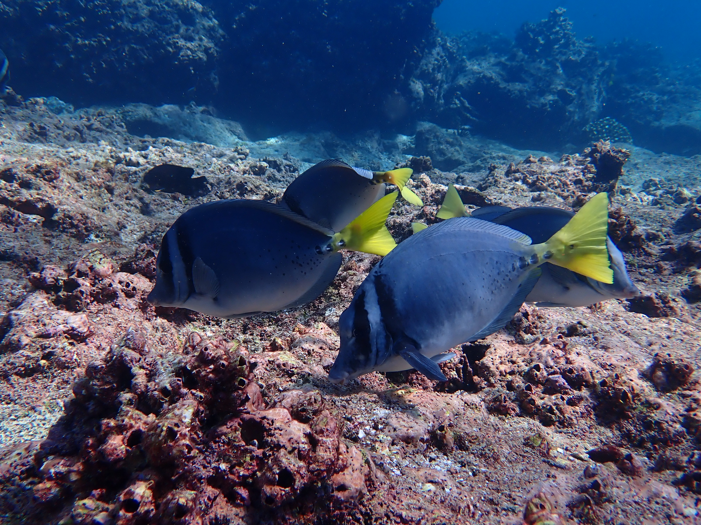
:::
::: news-paper-thumb

:::
::::
:::: news-item-text
[New Publication]{.badge-pub} · 2026

**Host matters: coral reef fish species show distinct skin microbiome responses to upwelling-driven environmental changes**

Lardinois LL, Hinojosa NA, Quintero-Arrieta H, Sellers AJ, Leray M, Barrett RDH.\
*BMC Microbiology* s12866-026-05036-1
::::
:::::

::::: news-item
:::: news-item-images
::: news-field-photo
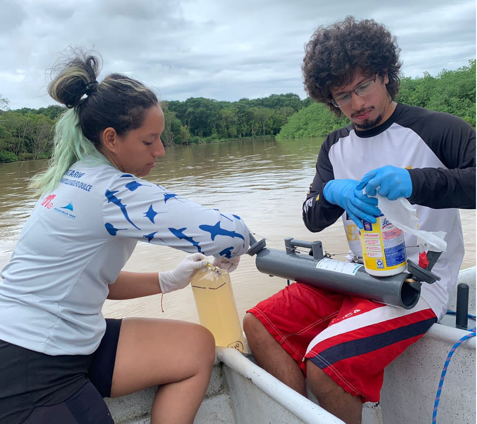
:::
::: news-paper-thumb

:::
::::
:::: news-item-text
[New Publication]{.badge-pub} · 2026

**Integrated reanalysis of global riverine fish eDNA datasets shows robustness and congruence of biodiversity conclusions**

Zhang Y, Zhang H, Akashi H, et al., Leray M, et al., Pellissier L, Zhang X, Altermatt F.\
*Molecular Ecology* 35, e70340
::::
:::::

::::: news-item
:::: news-item-images
::: news-field-photo
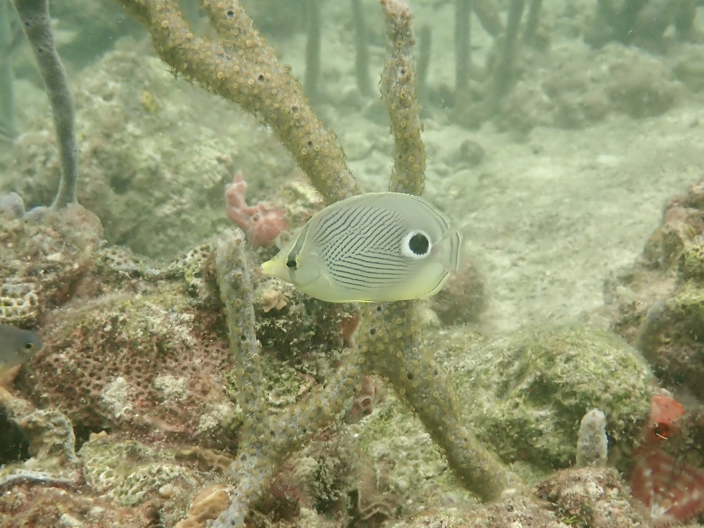
:::
::: news-paper-thumb

:::
::::
:::: news-item-text
[New Publication]{.badge-pub} · 2026

**Dietary resilience of coral reef fishes to habitat degradation**

Clever F, Preziosi RF, Nguyen B, De Gracia B, Quintero H, McMillan WO, Altieri AH, O'Dea A, Knowlton N, Leray M.\
*Journal of Animal Ecology* 95, 397-417
::::
:::::

::::: news-item
:::: news-item-images
::: news-field-photo
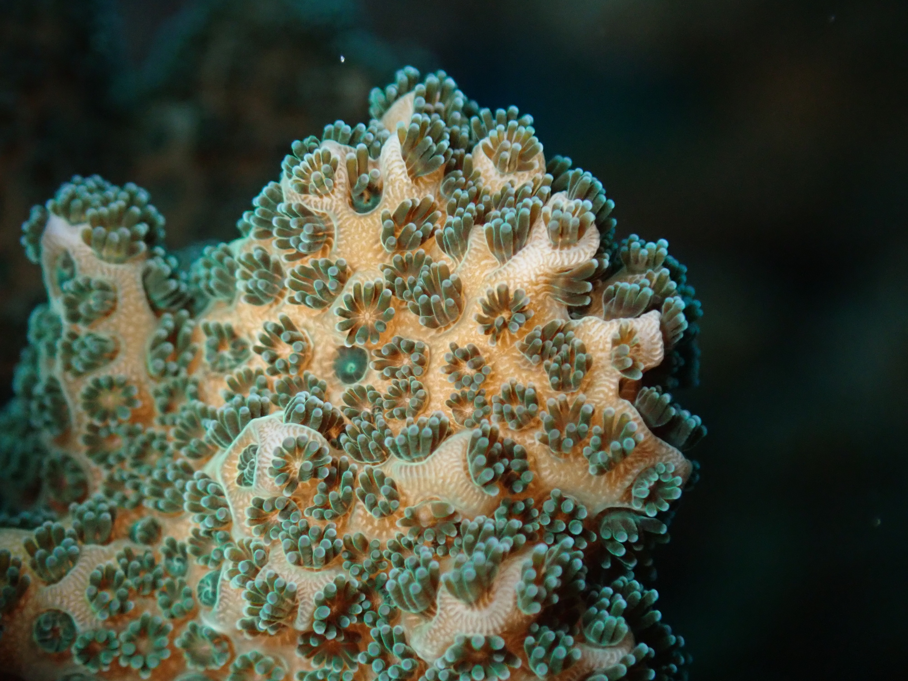
:::
::: news-paper-thumb
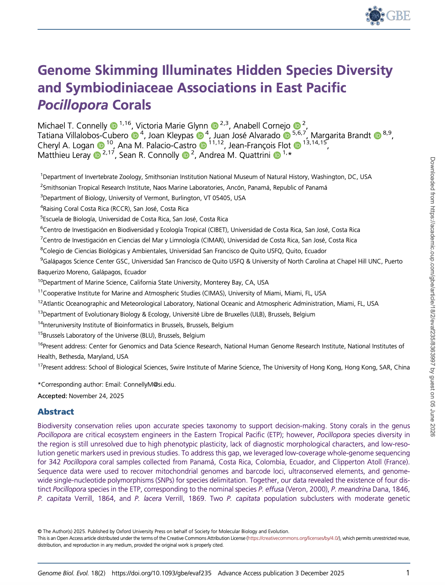
:::
::::
:::: news-item-text
[New Publication]{.badge-pub} · 2026

**Genome skimming illuminates hidden species diversity and Symbiodiniaceae associations in east Pacific *Pocillopora* corals**

Connelly MT, Glynn VM, Cornejo A, Villalobos-Cubero T, Kleypas J, Alvarado JJ, Brandt M, Logan CA, Palacio-Castro AM, Flot JF, Leray M, Connolly SR, Quattrini AM.\
*Genome Biology and Evolution* 18, evaf235
::::
:::::

::::: news-item
:::: news-item-images
::: news-field-photo

:::
::: news-paper-thumb

:::
::::
:::: news-item-text
[New Publication]{.badge-pub} · 2025

**Salish Sea crustacean biodiversity is remarkably high and increases with oceanic influences**

Hultgren KM, Paulay G, Cummings B, Leray M, Winans G.\
*Marine Biodiversity* 55, 121
::::
:::::

::::: news-item
:::: news-item-images
::: news-field-photo

:::
::: news-paper-thumb
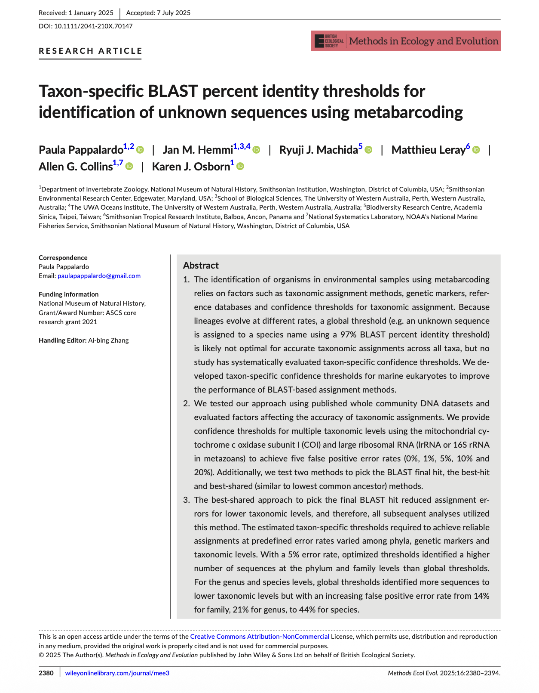
:::
::::
:::: news-item-text
[New Publication]{.badge-pub} · 2025

**Taxon-specific BLAST percent identity thresholds for identification of unknown sequences using metabarcoding**

Pappalardo P, Hemmi JM, Machida RJ, Leray M, Collins AG, Osborn KJ.\
*Methods in Ecology and Evolution* 16, 2380-2394
::::
:::::

::::: news-item
:::: news-item-images
::: news-field-photo
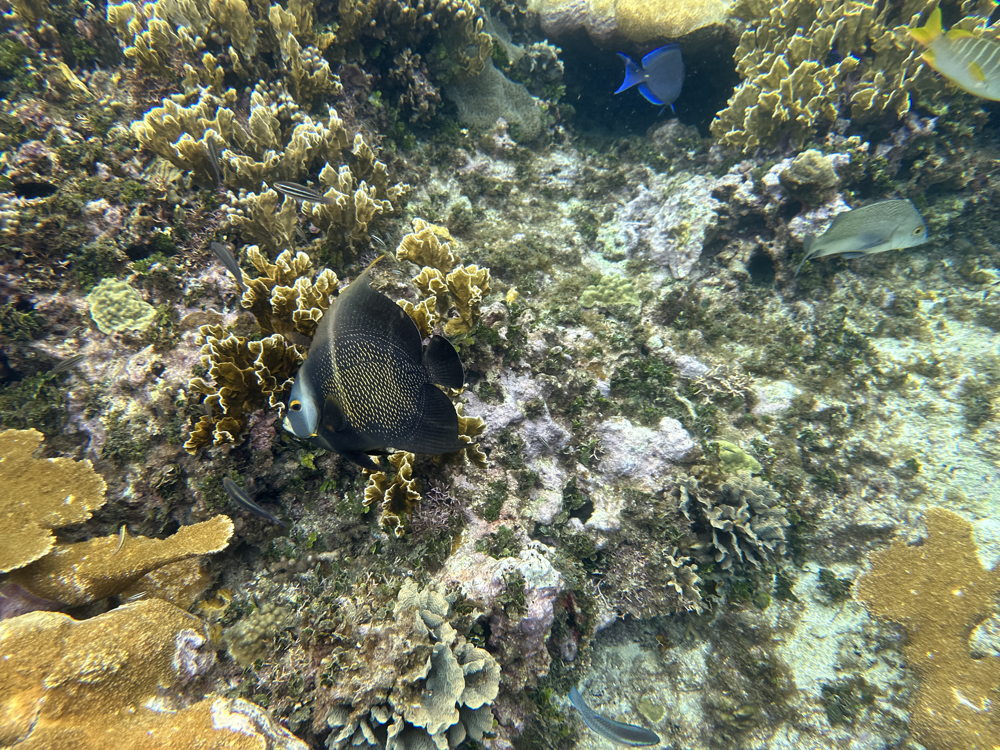
:::
::: news-paper-thumb
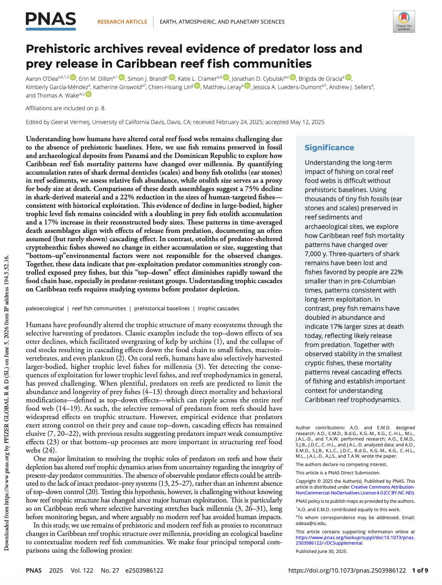
:::
::::
:::: news-item-text
[New Publication]{.badge-pub} · 2025

**Prehistoric archives reveal evidence of predator loss and prey release in Caribbean reef fish communities**

O'Dea A, Dillon EM, Brandl SJ, Cramer KL, Cybulski JD, de Gracia B, García-Méndez K, Griswold K, Lin CH, Leray M, Lueders-Dumont JA, Sellers AJ, Wake TA.\
*Proceedings of the National Academy of Sciences* 122, e2503986122
::::
:::::

::::: news-item
:::: news-item-images
::: news-field-photo
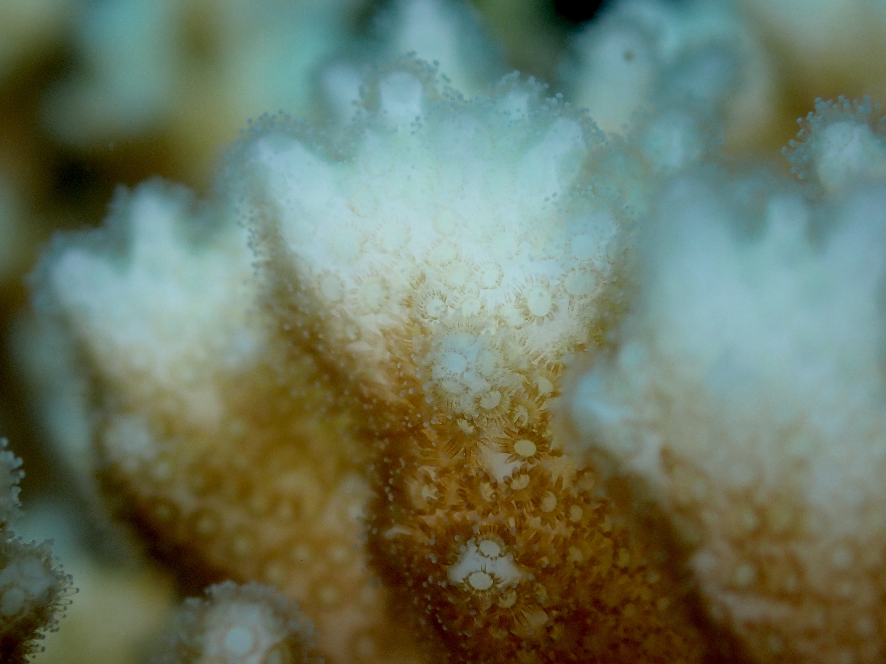
:::
::: news-paper-thumb
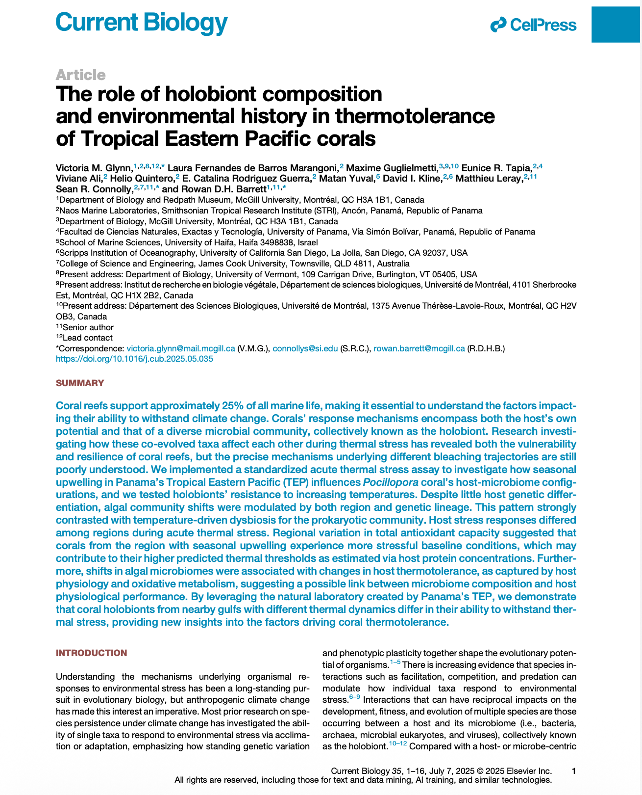
:::
::::
:::: news-item-text
[New Publication]{.badge-pub} · 2025

**The role of holobiont composition and environmental history in thermotolerance of Tropical Eastern Pacific corals**

Glynn VM, Fernandes de Barros Marangoni L, Guglielmetti M, Tapia ER, Ali V, Quintero H, Rodriguez Guerra EC, Yuval M, Kline DI, Leray M, Connolly SR, Barrett RDH.\
*Current Biology* 35, p3048-3063.e7
::::
:::::

::::: news-item
:::: news-item-images
::: news-field-photo
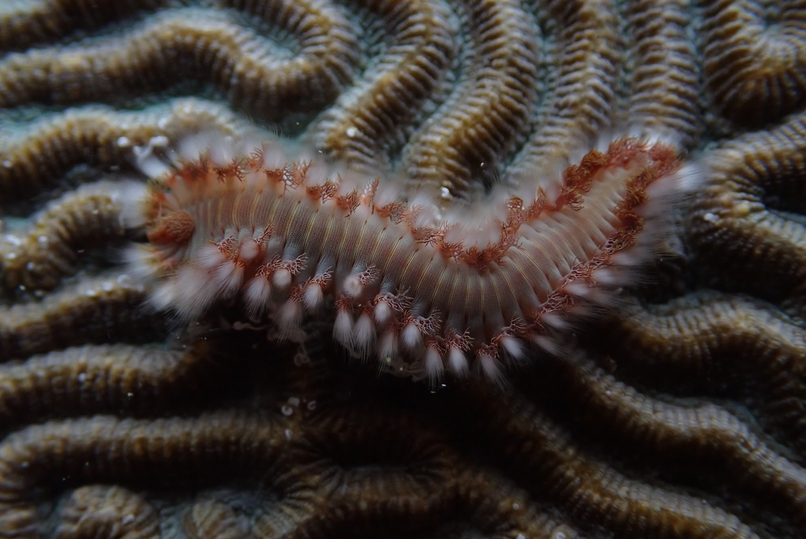
:::
::: news-paper-thumb

:::
::::
:::: news-item-text
[New Publication]{.badge-pub} · 2025

**Seasonal transcriptomic shifts reveal metabolic flexibility of chemosynthetic symbionts in an upwelling region**

Morel-Letelier I, Yuen B, Orellana LH, Kück AC, Camacho-García YE, Lara M, Leray M, Wilkins LGE.\
*MSystems* 10, e01686-24
::::
:::::

[View all publications →](Publications.qmd){.button}

---

## 🏕️ Fieldwork & Expeditions

::::: news-item
:::: news-item-images
::: news-field-photo

:::
::: news-paper-thumb

:::
::::
:::: news-item-text
[Fieldwork]{.badge-field} · 2024

**Moorea field season**

The lab conducted eDNA surveys and coral sampling across the forereef and backreef habitats of Moorea, French Polynesia, as part of the IstmoBiome and Reef Resilience projects.
::::
:::::

---

## 🔬 Lab Announcements

*Announcements coming soon — check back for updates on new lab members, grants, and awards.*

---

## 📰 Press & Media

*Press coverage and media features coming soon.*
