::::: banner
:::: banner-content
{.banner-logo}

<h1 class="banner-title">

Symbiosis & Resilience Lab

</h1>

::: tagline
Understanding how ecological interactions fuel resilience in a changing ocean
:::
::::
:::::

::: photo-strip
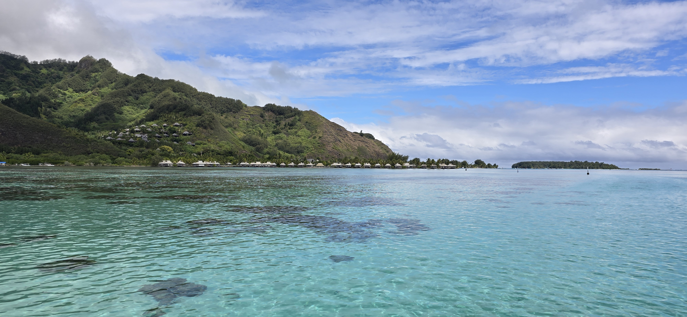{.strip-photo alt="Coral reef panorama in Moorea"}
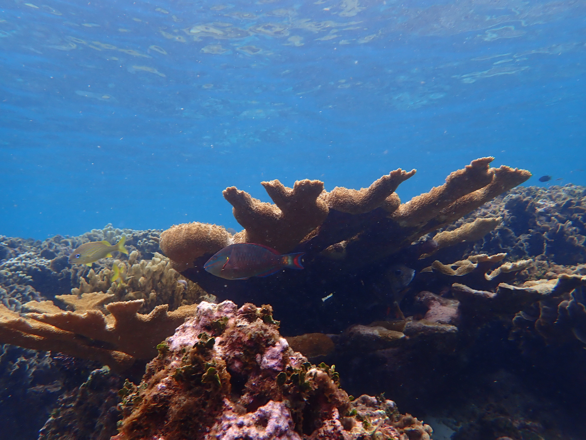{.strip-photo alt="Parrotfish on Acropora coral"}
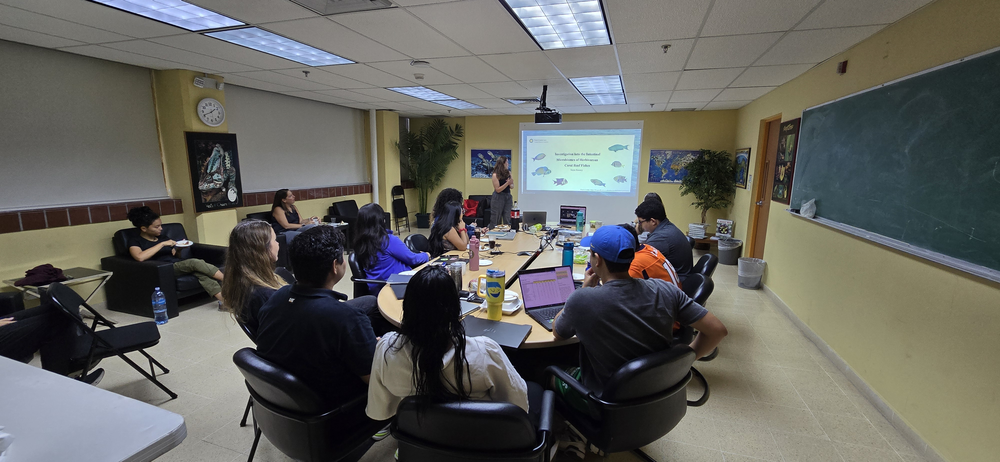{.strip-photo alt="Lab team in the field"}
:::

::: intro-section
The Symbiosis & Resilience Lab investigates how ecological interactions - from host–microbe partnerships to herbivory and top-predator dynamics - shape the structure, functioning, and resilience of coral reefs and other tropical marine ecosystems in a changing ocean.
:::

::: {.section .light-section}
## 📰 Latest News

:::: news-preview-grid

::: news-preview-card
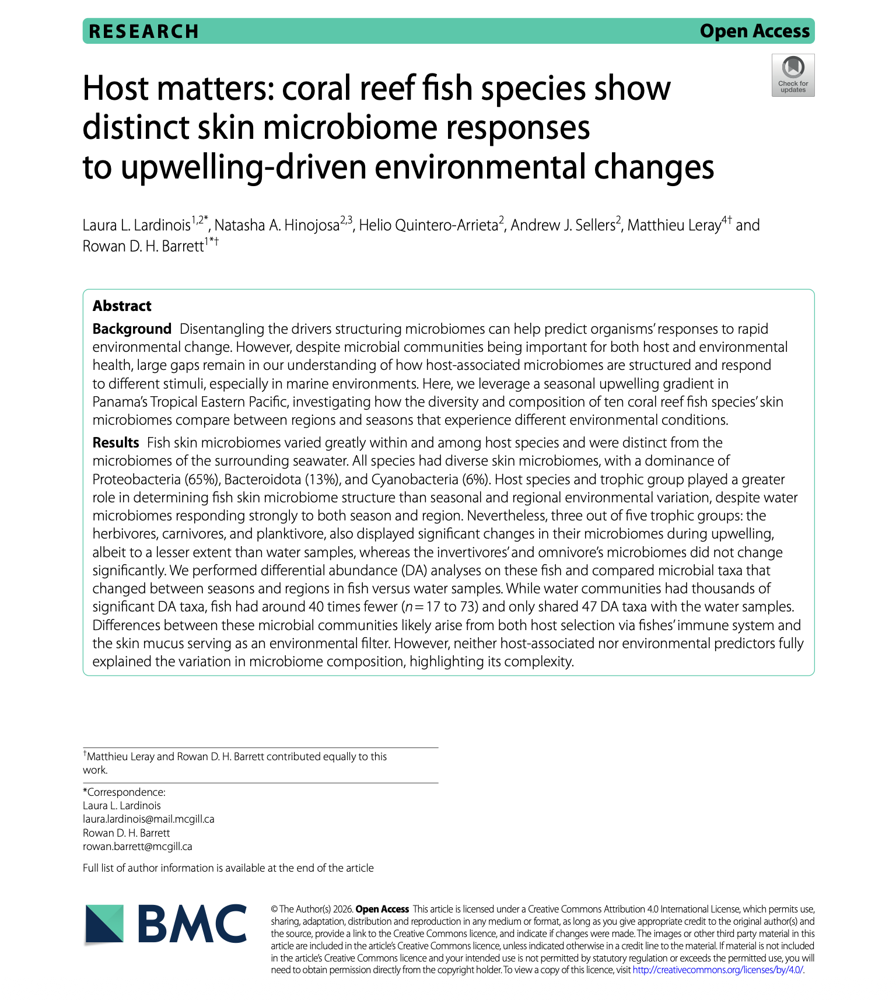{.news-preview-img}

[New Publication]{.badge-pub}

**Host matters: coral reef fish species show distinct skin microbiome responses to upwelling-driven environmental changes**

Lardinois LL et al. · *BMC Microbiology* · 2026
:::

::: news-preview-card
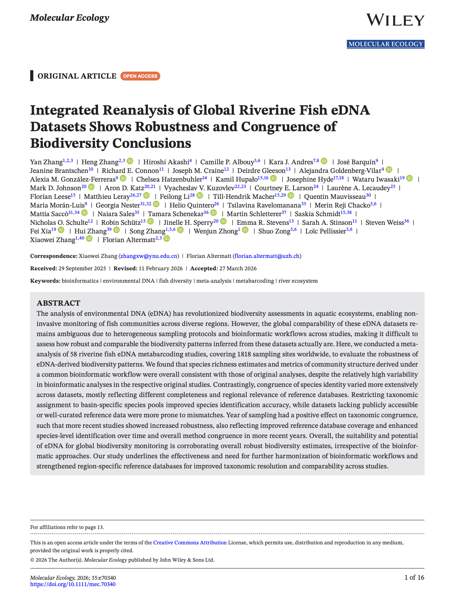{.news-preview-img}

[New Publication]{.badge-pub}

**Integrated reanalysis of global riverine fish eDNA datasets shows robustness and congruence of biodiversity conclusions**

Zhang Y et al. · *Molecular Ecology* · 2026
:::

::: news-preview-card
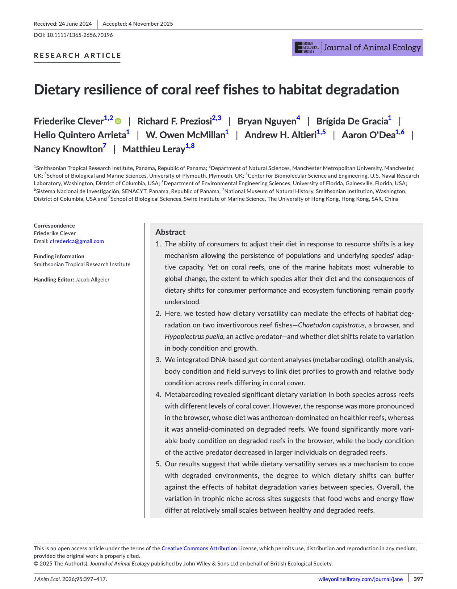{.news-preview-img}

[New Publication]{.badge-pub}

**Dietary resilience of coral reef fishes to habitat degradation**

Clever F et al. · *Journal of Animal Ecology* · 2026
:::

::::

[View all news →](News.qmd){.button}
:::

::: section-heading
## 🔬 Our Research
:::

:::: research-row
::: research-img
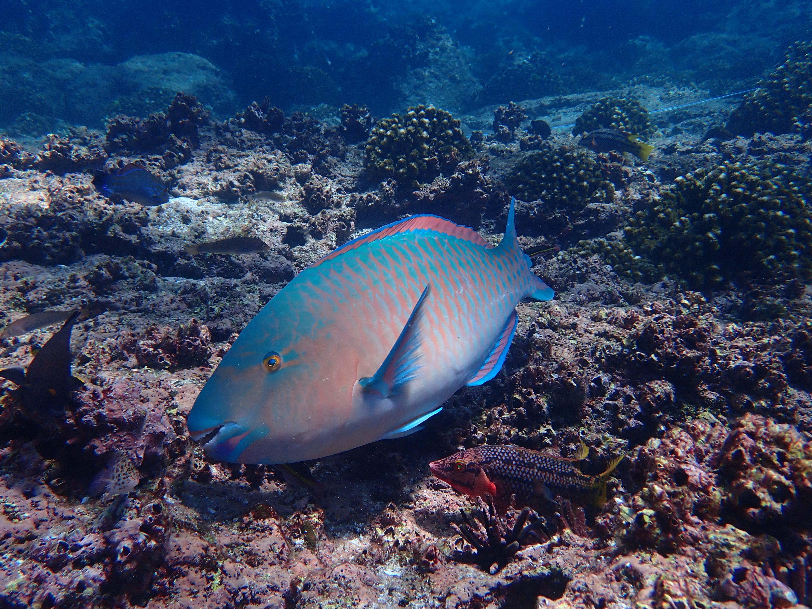
:::
::: research-text
### Ecological versatility and the persistence of coral reef communities

Species-rich coral reefs are sustained by complex ecological interactions and fine-scale partitioning of resources. While specialization can reduce competition and promote coexistence in undisturbed environments, it may also make species vulnerable when conditions shift or resources decline. Our research examines how reef-associated fishes and invertebrates with apparent specializations can switch to alternative resources as a mechanism to cope with changing environments. By studying the degree and consequences of trophic and functional versatility, we aim to understand how species and communities will persist on the coral reefs of the Anthropocene.
:::
::::

:::: {.research-row .research-row-reverse}
::: research-img
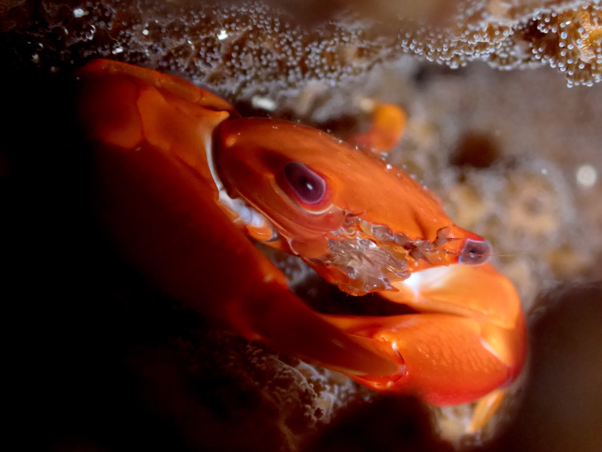
:::
::: research-text
### The role of microbes in mediating how marine animals cope with environmental change

The diverse assemblages of bacteria, archaea, unicellular eukaryotes, and viruses that form microbiomes play critical roles in the health of marine animals and may also facilitate host responses to both local (e.g., deoxygenation, pollution) and global stressors (e.g., warming, acidification). Because microbiome composition can shift rapidly and microbial genomes evolve quickly through mutation and gene exchange, these communities may represent a powerful source of ecological and evolutionary innovation. Our research investigates how microbes influence host traits, and how hosts shape their microbiomes, across ecological and evolutionary timescales in diverse taxa including corals and fishes.
:::
::::

:::: research-row
::: research-img
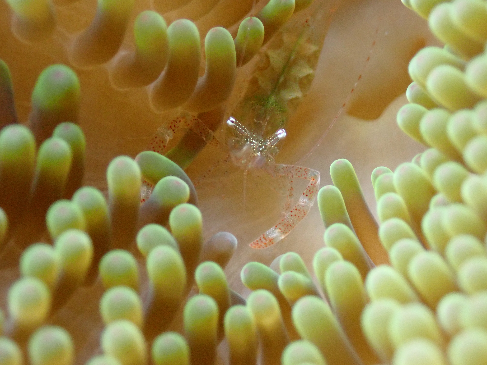
:::
::: research-text
### Hidden biodiversity and ecological patterns through environmental DNA

Most marine species remain undescribed and difficult to distinguish, particularly the small and cryptic organisms that dominate tropical ecosystems. To address these knowledge gaps, we use environmental DNA (eDNA) - broadly defined as any DNA collected from an environmental sample - to uncover patterns of taxonomic, functional, and phylogenetic diversity across tropical coastal habitats. This work provides critical insights for the conservation of endangered species and the management of exploited marine resources.
:::
::::

::: section-heading
## 🌊 The Lab
:::

:::: {.research-row .research-row-reverse}
::: research-img
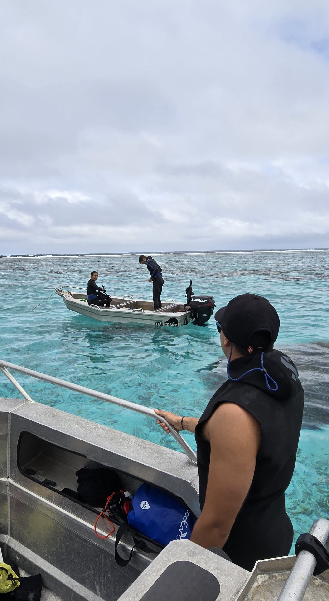
:::
::: research-text
## 👥 About the Team

The Symbiosis & Resilience Lab brings together field ecologists, molecular biologists, and data scientists to understand how interactions among marine organisms - from microscopic symbionts to large predators - drive the resilience of coral reefs and coastal ecosystems facing environmental change.

[Meet Our Team](Team.qmd){.row-button}
:::
::::

:::: research-row
::: research-img
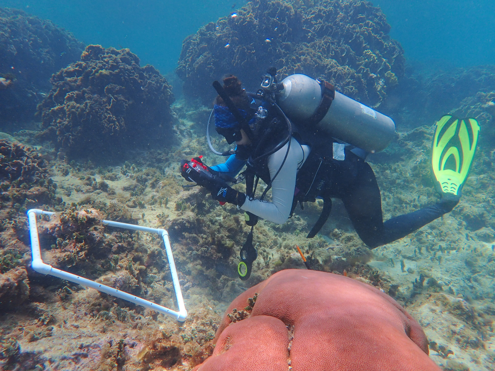
:::
::: research-text
## ⚙️ Our Methods

Our research integrates broad-scale environmental sampling, molecular and genomic analyses, and experimental approaches in both field and laboratory settings to quantify the ecological interactions sustaining marine biodiversity and resilience.

[Research In Action](Projects.qmd){.row-button}
:::
::::

:::: {.research-row .research-row-reverse}
::: research-img
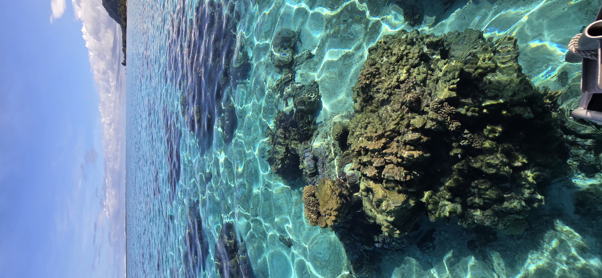
:::
::: research-text
## 🎓 Join Us

We welcome motivated students, postdocs, and collaborators passionate about marine biodiversity and molecular ecology. If you're curious about how ecosystems respond to environmental change, we'd love to hear from you.

[Explore Opportunities](join-us.qmd){.row-button}
:::
::::

::: {.section .light-section}
## 🌍 Connect

Follow our research and updates, and learn more about our work in the field and the lab.\
[Contact us →](join-us.qmd)
:::

::::: instagram-section
### 📸 Latest from Instagram

:::: {.embedsocial-hashtag data-ref="20558da48e098a524a239b2023b9c92fe158f752"}
<a class="feed-powered-by-es feed-powered-by-es-feed-img es-widget-branding"
    href="https://embedsocial.com/social-media-aggregator/"
    target="_blank"
    title="Instagram widget"> 

::: es-widget-branding-text
Instagram widget
:::

</a>
::::

:::::

### 🔗 Follow Us

::: social-links
   
:::
