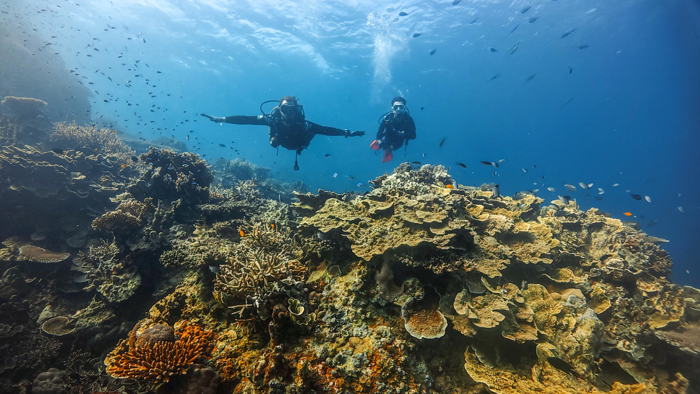
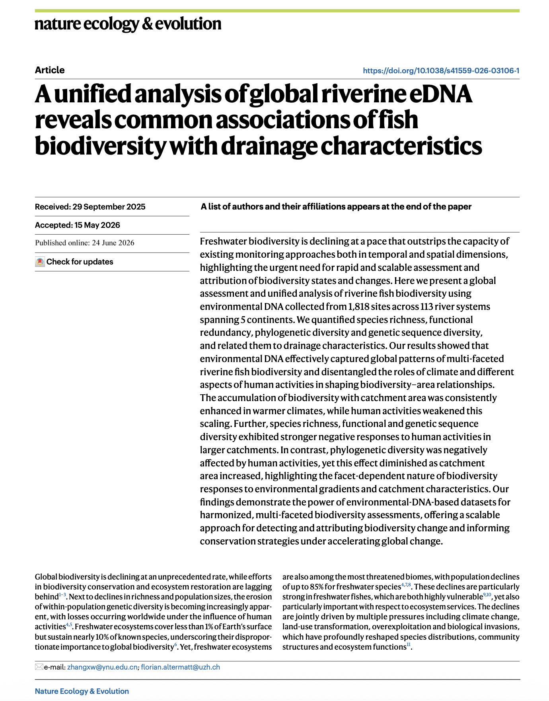
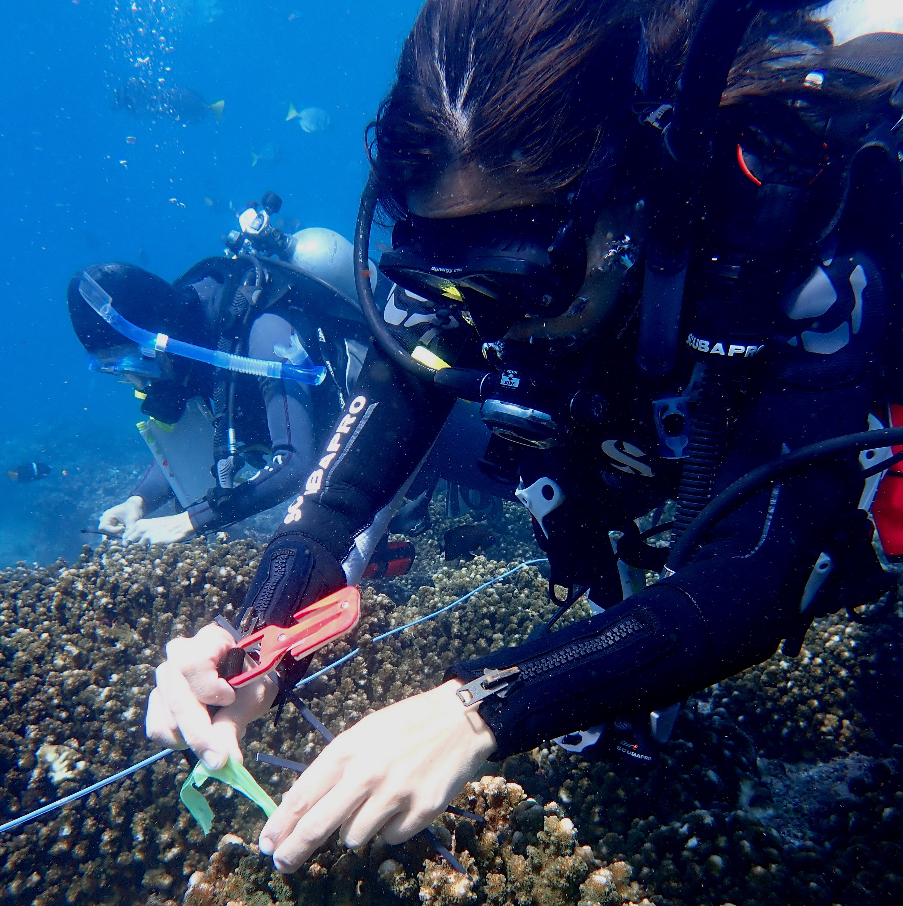
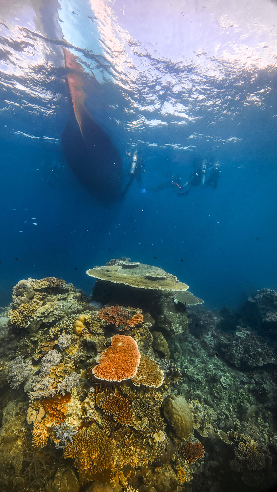

::::: banner
:::: banner-content
{.banner-logo}

<h1 class="banner-title">

Symbiosis & Resilience Lab

</h1>

::: tagline
Understanding how ecological interactions fuel resilience in a changing ocean
:::
::::
:::::

::: photo-strip
{.strip-photo alt="Coral reef panorama"}
{.strip-photo alt="Parrotfish on Acropora coral"}
{.strip-photo alt="Lab team in the field"}
:::

::: intro-section
The Symbiosis & Resilience Lab investigates how ecological interactions - from host–microbe partnerships to herbivory and top-predator dynamics - shape the structure, functioning, and resilience of coral reefs and other tropical marine ecosystems in a changing ocean.
:::

::: {.section .light-section}
## 📰 Latest News

:::: news-preview-grid

::: news-preview-card
{.news-preview-img}

[New Publication]{.badge-pub}

**A unified analysis of global riverine eDNA reveals common associations of fish biodiversity with drainage characteristics**

Zhang Y et al. · *Nature Ecology & Evolution* · 2026
:::

::: news-preview-card
{.news-preview-img}

[New Publication]{.badge-pub}

**Host matters: coral reef fish species show distinct skin microbiome responses to upwelling-driven environmental changes**

Lardinois LL et al. · *BMC Microbiology* · 2026
:::

::: news-preview-card
{.news-preview-img}

[New Publication]{.badge-pub}

**Integrated reanalysis of global riverine fish eDNA datasets shows robustness and congruence of biodiversity conclusions**

Zhang Y et al. · *Molecular Ecology* · 2026
:::

::::

[View all news →](News.qmd){.button}
:::

::: section-heading
## 🔬 Our Research
:::

:::: research-row
::: research-img

:::
::: research-text
### Functional versatility and the persistence of coral reef communities

Many species can coexist on coral reefs because each one uses food and space a little differently. But this specialization can leave species vulnerable when conditions change. We study the ability of reef animals to switch to new resources and roles to understand which species can cope with and persist through the ongoing degradation of coral reefs worldwide.
:::
::::

:::: {.research-row .research-row-reverse}
::: research-img

:::
::: research-text
### The role of symbioses in resilience

Marine life depends on close partnerships between species. These range from the microbes living inside and on the surfaces of corals and fishes to the crabs and shrimps that shelter among coral branches. We study how these partnerships shape the species involved and how they support the resilience of organisms and ecosystems in the face of global changes.
:::
::::

:::: research-row
::: research-img

:::
::: research-text
### Hidden tropical biodiversity

Much of marine life is small, hidden, and still unnamed. We use the genetic traces animals leave in the water (environmental DNA) to monitor this overlooked diversity, and to detect rare, endangered and invasive species that traditional surveys often miss.
:::
::::

::: section-heading
## 🌊 The Lab
:::

:::: {.research-row .research-row-reverse}
::: research-img

:::
::: research-text
## 👥 About the Team

The Symbiosis & Resilience Lab brings together field ecologists, molecular biologists, and data scientists to understand how interactions among marine organisms - from microscopic symbionts to large predators - drive the resilience of coral reefs and coastal ecosystems facing environmental change.

[Meet Our Team](Team.qmd){.row-button}
:::
::::

:::: research-row
::: research-img

:::
::: research-text
## ⚙️ Our Methods

Our research integrates broad-scale environmental sampling, molecular and genomic analyses, and experimental approaches in both field and laboratory settings to quantify the ecological interactions sustaining marine biodiversity and resilience.

[Research In Action](Projects.qmd){.row-button}
:::
::::

:::: {.research-row .research-row-reverse}
::: research-img

:::
::: research-text
## 🎓 Join Us

We welcome motivated students, postdocs, and collaborators passionate about marine biodiversity and molecular ecology. If you're curious about how ecosystems respond to environmental change, we'd love to hear from you.

[Explore Opportunities](join-us.qmd){.row-button}
:::
::::

::: {.section .light-section}
## 🌍 Connect

Follow our research and updates, and learn more about our work in the field and the lab.\
[Contact us →](join-us.qmd)
:::

::::: instagram-section
### 📸 Latest from Instagram

:::: {.embedsocial-hashtag data-ref="20558da48e098a524a239b2023b9c92fe158f752"}
<a class="feed-powered-by-es feed-powered-by-es-feed-img es-widget-branding"
    href="https://embedsocial.com/social-media-aggregator/"
    target="_blank"
    title="Instagram widget"> 

::: es-widget-branding-text
Instagram widget
:::

</a>
::::

:::::

### 🔗 Follow Us

::: social-links
   
:::
